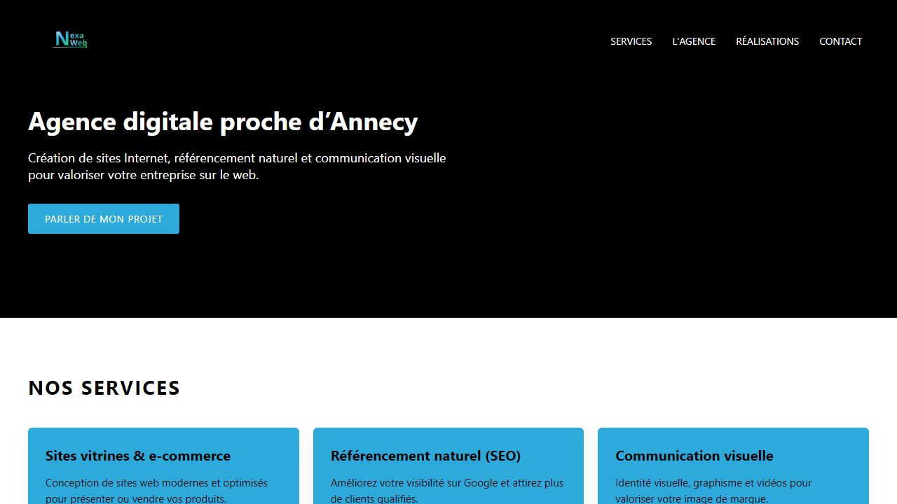

# NexaWeb

Site vitrine complet d'une agence web fictive : services, présentation, réalisations
et contact, dans un style minimaliste.

En ligne : https://dunandchatellet.fr/NexaWeb/NexaWeb.html

## Comment c'est fait

HTML et CSS uniquement, en une seule page, adaptée du téléphone au grand écran.

| Fichier | Rôle |
| --- | --- |
| `NexaWeb.html` | La page |
| `NexaWeb.css` | Mise en page et points de rupture |
| `Image/` | Logo et visuels |

La carte de visite assortie est dans mon dépôt
[Design](https://github.com/Pierre-Dunand-Chatellet/Design).

---

Pierre Dunand-Chatellet — [tous mes projets](https://dunandchatellet.fr/projets.html)
